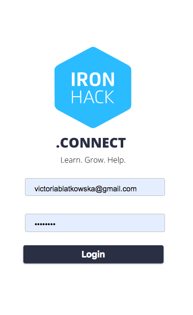

# ironhack-connect




Ironhack-connect is a platform for Ironhack alumni, with the primarly aim to serve as a job platform. Created together with [Jonathan Saudhof](https://github.com/JonathanSaudhof).

Demo : https://ironhack-connect.herokuapp.com/

user: admin@example.com
password: 1234


## Getting Started

This is a Node JS / Express / Handlebars / Mongoose app. After you cloned the repository.

### Installation

For the installation you need to clone the repo and change to the directory. Afterwards do a npm install. 

```
cd ironhack-connect
npm install 
```

### Seed the database

When you finished you need to ***setup your environmental variables for MongoDB***. Now, you can seed the database

```
node bin/seed.js
```

### Run the development server

```
npm run dev
```

## Run the Server

```
npm run start
```
